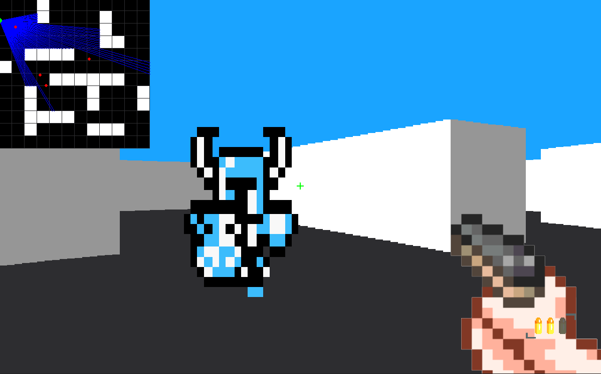

*Created by Joshua Auw-Yang*

This is a 3D raycasting game engine that recreates a retro first person shooter with pathfinding enemy AI.

A [raycaster](https://en.wikipedia.org/wiki/Ray_casting) casts multiple rays and stops once an obstacle is met. The length of this ray is then used to draw a slice of the obstacle, with shorter lengths rendering larger and closer walls whereas greater lengths render smaller and further walls. Combining all the slices produced by the casted ray creates a scenery similar to that of a 3-dimensional world.

To create a challenging game, enemies with pathfinding AI are implemented using an [A* search algorithm](https://en.wikipedia.org/wiki/A*_search_algorithm). Every frame, the pathfinder is run for each enemy to calculate the most optimal path to the player to account for the player's movements.



# Getting Started


## Installing pip

First, make sure you have ```pip``` installed on your system. Running the following command will display the current version of pip installed on your system:
* Windows
```sh
py -m pip --version
```
* Unix/MacOS
```sh
python3 -m pip --version
```


## Installing and creating a virtual environment
Next, make sure you have virtual environments installed using the following command:
* Windows
```sh
py -m pip install --user virtualenv
```
* Unix/MacOS
```sh
python3 -m pip install --user virtualenv
```


Now, create a virtual environment called ```env``` by running the following command in the root directory of the project:
* Windows
```sh
py -m venv env
```
* Unix/MacOS
```sh
python3 -m venv env
```

To activate the environment run ```env\Scripts\activate``` on Windows and ```source env/bin/activate``` for Unix/MacOS.
To deactivate run ```deactivate```

To install the required packages to run the project, use ```py -m pip install -r requirements.txt``` on Windows and ```python3 -m pip install -r requirements.txt``` on Unix/MacOS.

# How to Use

To start the program, run the `app.py` script.

The user will be loaded into a 3D maze-like world consisting of white walls with a blue sky. Infinite waves of undead knights will target and eliminate the user with their sword if they get close. The goal of the game is for the user to survive as long as possible with their 3-round semi-automatic pistol.

Enemies on the map are indicated by a red point and the user is indicated by a large green point.

## Controls

### Movement
* *W* - Move forwards
* *S* - Move backwards
* *A* - Move leftwards
* *D* - Move rightwards
* *Shift* - Hold down to run (only forwards)
* *Left arrow key* - Turn left
* *Right arrow key* - Turn right
* *Down arrow key* - Hold down for slowed turning

### Combat
* *Space bar* - Shoot (must tap to shoot)
* *R* - Reload the pistol


## Configuration

The settings of the game can be adjusted in the ```config.py``` file. The following parameters can be adjusted:

* *CROSSHAIR_LENGTH* - Changes crosshair length
* *CROSSHAIR_WIDTH* - Changes crosshair width
* *CROSSHAIR_COLOUR* - Changes crosshair colour
* *FOV* - Changes player's field of view
* *LIMITED_VISION* - Determines whether user can see enemies on the map outside of their view
* *MAX_ENEMIES* - Determines the maximum number of enemies that can be present on the map at the same time